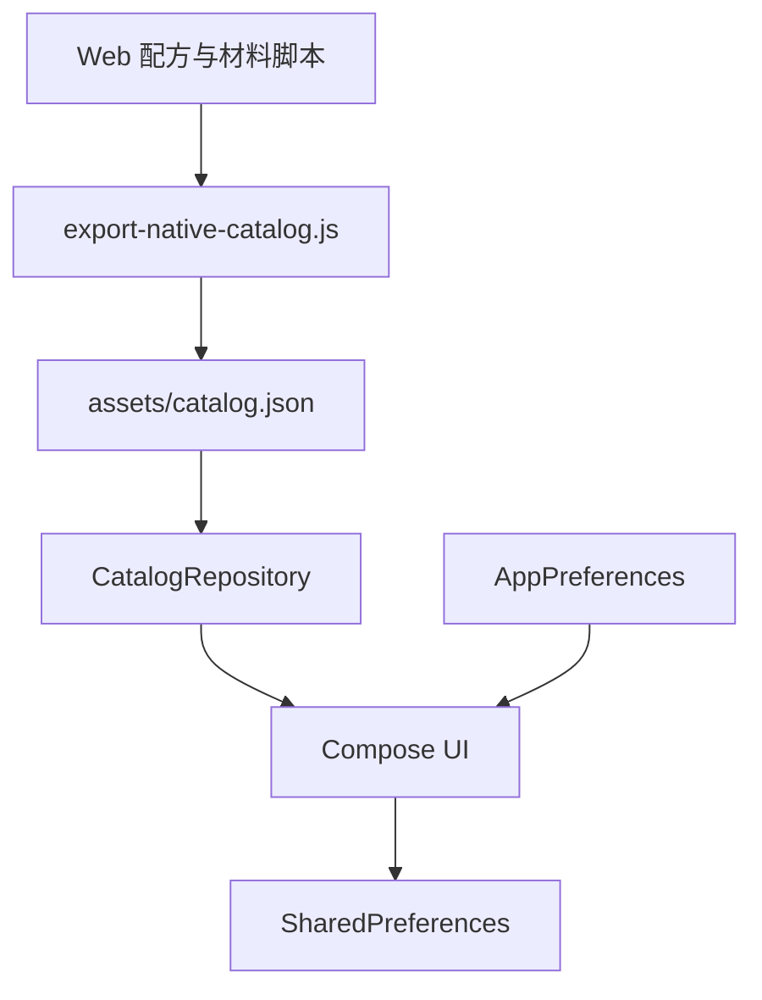

# 朝露酒笺原生 Android 迁移与发布计划

> 状态：v0.3.0-alpha01；更新时间：2026-07-30。

## 1. 目标与发行策略

朝露酒笺保留两种独立发行形态：

1. **Web/PWA**：继续承担功能完整、本地优先、无需安装和 iPhone 主屏幕安装场景。
2. **Android 原生应用**：使用 Kotlin 与 Jetpack Compose 提供更稳定的 Android 交互、自适应布局、系统能力接入和后续商店发布基础。

原生应用不再把网页打包进 WebView。Web 与 Android 共用稳定的配方和材料标识，通过构建期导出的 `catalog.json` 同步只读目录，但分别实现界面、交互和本地状态。

## 2. 当前原生架构

主要模块：

- `MainActivity.kt`：原生应用入口和主题接入。
- `data/Models.kt`：本地化文本、材料与配方模型。
- `data/CatalogRepository.kt`：从应用 assets 读取配方目录。
- `data/AppPreferences.kt`：语言、收藏与今夜酒单持久化。
- `ui/DawnsDewApp.kt`：页面状态、响应式导航、配方列表和详情界面。
- `ui/theme/Theme.kt`：品牌色板、排版和形状。

## 3. v0.3 Alpha 已实现范围

- 首页、配方浏览、搜索、配方详情。
- 中英文切换。
- 收藏和今夜酒单。
- SharedPreferences 本地持久化。
- `< 840dp` 底部导航与 `≥ 840dp` Navigation Rail。
- `GridCells.Adaptive(250.dp)` 自适应配方网格。
- 窄屏统计卡与详情操作区自动重排。
- Canvas 原生杯型、酒液、装饰和光晕。
- 环境光漂移、首页呼吸、页面切换、卡片分批入场、按压反馈和图标状态动画。
- 根据 Android 动画缩放设置禁用或减少自定义动画。
- Android 7.0（API 24）到目标 API 36 的构建配置。

## 4. 与 Web v0.2 的功能差距

正式版前仍需补齐或明确取舍：

- 酒柜、库存、价格、包装容量和材料酒精度管理。
- 可制作、差一种和缺少多种材料匹配。
- 完整酒精度、酒液体积和成本估算。
- 自定义配方的创建、编辑、复制和删除。
- 普通随机与聚会防重复推荐。
- 最近查看、更多筛选与数据管理。
- JSON 导入导出与跨设备手动迁移。
- Web 与原生间的数据结构兼容测试。

## 5. 数据迁移与覆盖升级风险

旧 Android v0.2 是 Capacitor/WebView 应用，用户状态位于 WebView localStorage；原生 v0.3 使用 SharedPreferences。两者不是同一存储系统，当前 Alpha 无法自动读取旧数据。

正式覆盖升级前至少选择并完成一个方案：

### 推荐方案：JSON 显式迁移

1. 在旧 Web/PWA 版导出版本化 JSON。
2. 原生版通过 Android Storage Access Framework 打开系统文件选择器。
3. 校验版本、稳定 ID、字段类型和引用完整性。
4. 显示导入预览、冲突策略和结果摘要。
5. 迁移收藏、今夜酒单、酒柜、自定义配方、历史与设置。

优点是可审计、可回滚，也能支持浏览器与新设备间迁移。

### 备选方案：一次性旧数据迁移器

在与旧 APK 相同签名和 applicationId 的升级环境中，保留一次性 WebView/localStorage 读取路径，将旧状态转换后写入原生存储。该方案实现和测试成本更高，且需要覆盖不同 WebView 版本和异常状态。

无论采用哪种方案，都必须：

- 保持 `com.zalandunk.dawnsdew` 不变。
- 使用与已发布 Android 包一致的正式签名证书，才能原地升级。
- 在迁移成功前保留旧数据，不进行不可逆清理。
- 对空数据、损坏数据、重复 ID、旧版本字段和部分导入进行测试。

## 6. 正式发布门槛

### 工程与安全

- 使用私有 release keystore；密钥和密码不得提交到仓库。
- 通过环境变量或受控 CI secret 注入签名配置。
- 生成并验证 release AAB；Debug APK 仅用于内部测试。
- 保持 R8/资源压缩开启，并检查混淆后的启动、序列化和资源读取。
- 记录版本号、签名证书指纹、AAB SHA-256 和构建环境。

### 功能与数据

- 确认功能对等清单，或在产品页面清晰标注不支持项。
- 完成旧数据迁移方案和失败回滚。
- 验证卸载、清数据、覆盖安装、降级拒绝和跨版本升级行为。

### 质量与兼容

- 至少覆盖 320dp 窄屏、常见手机、折叠/大屏和平板窗口。
- 覆盖 Android 7、主流中间版本和目标 Android 16。
- 检查字体缩放、显示缩放、深色主题、横屏、分屏和系统减少动态效果。
- 完成 TalkBack、触控尺寸、焦点顺序和内容描述检查。
- 对低性能设备检查动画掉帧、首屏时间和内存占用。

## 7. 分阶段路线

### 阶段 A：原生壳与视觉基线（已完成）

- Compose 工程、原生导航、自适应布局和品牌主题。
- 配方目录同步、浏览、搜索、详情、收藏和今夜酒单。
- Debug APK 构建与基础单元测试。

### 阶段 B：数据与核心功能对等

- 定义原生状态模型和版本化迁移规则。
- 完成酒柜、可制作匹配、ABV/成本计算和更多筛选。
- 完成自定义配方、随机推荐和最近查看。
- 增加 ViewModel/Repository 分层，拆分当前大型 UI 文件。

### 阶段 C：导入导出与升级迁移

- 接入系统文件选择器，不申请不必要的存储权限。
- 完成 JSON 导入导出、校验、预览、冲突处理和测试夹具。
- 使用旧签名包执行真实覆盖升级演练。

### 阶段 D：设备验收和发布工程

- 自动化 UI/截图回归与多窗口尺寸检查。
- 实体设备兼容、性能、无障碍和离线验收。
- 配置 release 签名、CI 构建和 AAB 验证。
- 准备隐私说明、版本说明、商店素材和回滚方案。

## 8. 当前结论

从工程可行性看，朝露酒笺已经可以重构为真正的原生 APK，并且当前 Debug APK 已完全由 Compose 原生界面驱动。Web/PWA 应作为独立产品形态继续保留。

v0.3.0-alpha01 仍不应直接作为正式覆盖升级版本：功能尚未完全对等、旧 localStorage 尚未迁移、正式签名未配置，并且还缺少模拟器/实体设备的视觉、交互和升级验收。