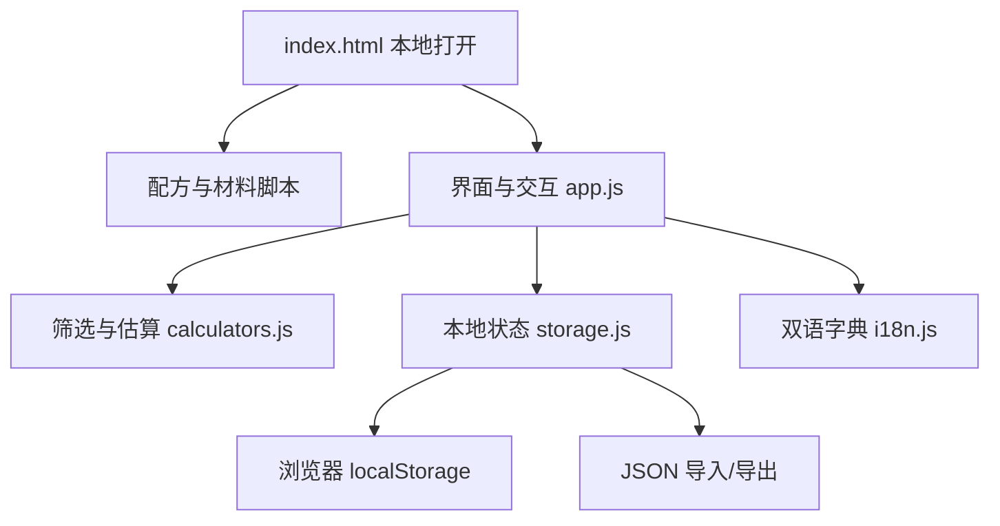

# 破晓微醺 v0.0.1 产品详细方案

## 1. 产品定位

**破晓微醺**是一款为家庭调酒爱好者设计的本地优先调酒工具。它不以专业酒吧库存系统为第一目标，而是解决家庭环境中的实际问题：手边只有少量基酒、便利店饮料和常见水果时，如何快速找到能做的酒、理解制作步骤，并逐渐建立自己的酒单与酒柜。

英文名称暂定 **Dawn's Dew**，与中文名称共同表达“夜色将尽、微醺未散”的视觉和情绪方向。

## 2. 目标用户

- 刚开始学习调酒、希望步骤直观的家庭爱好者
- 已经购买少量基酒，希望提高材料利用率的用户
- 喜欢记录个人配方、商品饮料组合与口味评级的用户
- 聚会时需要快速、随机且尽量不重复推荐的人
- 希望所有私人酒柜数据保存在本机的用户

## 3. 核心场景

1. **查看配方**：浏览个人酒单、经典酒和便利店灵感。
2. **按材料找酒**：勾选家中现有材料，快速显示可以制作的配方。
3. **学习调酒**：查看双语材料、制作方式、顺序和难度。
4. **聚会推荐**：优先从可制作配方中随机，并在短期内避免重复。
5. **管理酒柜**：记录材料、库存、价格、包装容量和实际酒精度。
6. **记录灵感**：创建自己的双语配方，并参与搜索和匹配。
7. **迁移与备份**：通过 JSON 文件把数据带到另一台设备。

## 4. v0.0.1 功能范围

### 4.1 配方库

- 45 杯内置配方；数据按个人、经典和便利店灵感分类。
- 搜索范围包括中文名、英文名、别名、基酒和全部材料。
- 支持来源、基酒、口味、难度、可制作、收藏六类筛选。
- 配方卡片展示来源、评级、难度、估算 ABV 和材料匹配状态。

### 4.2 配方详情

- 双语名称、介绍和步骤。
- 材料用量支持固定毫升、份/个、加至杯量比例、补满四种形式。
- 展示个人原始配方记录，避免结构化过程中丢失语境。
- 展示估算 ABV、酒液量、成本和制作方式。
- 缺少材料可以一键加入酒柜清单。

### 4.3 个人酒柜

每种材料可记录：

- 是否拥有
- 当前库存（ml 或份）
- 购入价格
- 包装容量
- 实际酒精度

系统根据“是否拥有”和大于零的库存判断材料可用性。空库存数值代表只记录拥有状态，不对数量作限制。

### 4.4 随机推荐

- 普通随机：从全部配方中随机。
- 聚会随机：优先从当前可制作配方中选择，并记录最近推荐以减少重复。
- 当可制作集合为空时自动退回全部配方，保证功能始终可用。

### 4.5 收藏、历史和自定义

- 收藏和最近查看均自动保存。
- 自定义配方要求中英文名称、中英文步骤、基酒和至少一种材料。
- 自定义配方进入统一配方库，参与筛选、收藏、匹配和估算。

### 4.6 数据管理

- 使用版本键 `dawnsdew.v0.0.1.state` 保存。
- 导出文件包含产品标识、结构版本、导出时间和完整状态。
- 导入前验证版本和基本结构，并把旧状态保存为本地备份。
- 支持重置用户数据；内置配方不会被删除。

## 5. 配方量化规则

### 5.1 杯量

- 默认杯容量为 300 ml。
- 满冰时默认有效酒液容量为 150 ml。
- 用户可在设置中修改两项容量。

### 5.2 顺序计算

材料严格按配方顺序计算：

1. 固定 `ml` 直接累加。
2. `fillTo: 0.8` 表示补到有效容量的 80%。
3. `topUp` 表示补到有效容量的 100%。
4. 后续固定材料仍按原配方加入，因此总量可能超过容量。
5. 超出时不修改原配方，只显示容量警告。

### 5.3 酒精度与成本

```text
估算 ABV = Σ(材料体积 × 材料 ABV) ÷ 总酒液体积
估算成本 = Σ(购入价 ÷ 包装容量 × 本杯用量)
```

装饰物、冰块及按“份/个”计量的材料在首版中不进入液体体积。只要部分液体材料具有价格，系统就展示成本并用星号表示价格覆盖不完整。

## 6. 内容策略

### 6.1 个人配方

- 保留原始中文名称，不擅自标准化商品名。
- 商品名如“水溶C”“莓莓桃桃”“阿萨姆茉莉奶绿”保持原名。
- 个人评级 `S+ / S / B / D` 作为口味记录展示，不解释为专业评分。
- 英文名称采用意境翻译，而不是机械直译。
- 个人版本的“血腥玛丽”和“自由古巴”明确标注“破晓特调版”。

### 6.2 经典与灵感配方

- 经典配方用于家庭学习和结构参考。
- 便利店灵感配方独立编写，不复制第三方项目内容。
- 测试版不使用外部照片，视觉由 CSS 和内联 SVG 生成，降低版权风险并保证离线使用。

## 7. 技术架构



技术原则：

- 原生 HTML、CSS、JavaScript，多文件但无构建步骤。
- 不使用模块导入和本地 `fetch()`，保证 `file://` 场景兼容性。
- 无网络依赖、无第三方运行时依赖。
- 所有数据脚本通过 `window.DD_DATA` 组合。
- 所有用户输入在渲染前进行 HTML 转义。

## 8. 视觉与交互

- 主题命名为“破晓金夜”。
- 主色：黑金、酒红、黎明橙、暮色紫。
- 配方视觉使用渐变色和抽象杯形，不依赖图片资源。
- 桌面端使用固定侧栏，移动端使用底部导航。
- 尊重系统“减少动态效果”偏好。

## 9. 非功能目标

- 双击即用，离线可用。
- 首屏和筛选交互无需网络等待。
- 电脑和手机均能完成核心任务。
- 本地保存失败时给出明确状态，不阻止继续浏览内置配方。
- 数据文件结构可测试，内置配方和材料 ID 必须保持稳定。

## 10. 后续路线建议

### v0.0.2

- 自定义配方编辑与复制
- 配方排序、标签多选和更细的匹配比例
- 库存单位与水果/装饰物成本换算
- 一键生成采购清单
- 更完整的键盘与无障碍体验

### v0.1.0

- 可选的 PWA 安装与离线缓存
- 制作后扣减库存
- 杯型、冰型、稀释率和份数换算
- 用户自定义材料与材料别名
- 配方卡片打印或分享图生成

### 更长期

- 在用户主动选择的前提下提供账号和跨设备同步
- 可选云端配方库与社区分享
- 聚会模式中的人数、强度和预算规划
- 个人口味反馈驱动的推荐模型

## 11. 验收标准

- 本地双击 `index.html` 后所有核心页面可访问。
- 内置配方总数为 45，个人配方为 25。
- 每个配方引用的材料 ID 都存在于材料目录。
- 每个配方都有中英文名称、介绍和步骤。
- 中英文切换覆盖静态页面和运行时内容。
- 酒柜、收藏、自定义配方和设置刷新后可恢复（浏览器支持本地存储时）。
- 导出文件可由同版本重新导入。
- JavaScript 通过语法检查，数据完整性测试通过。
