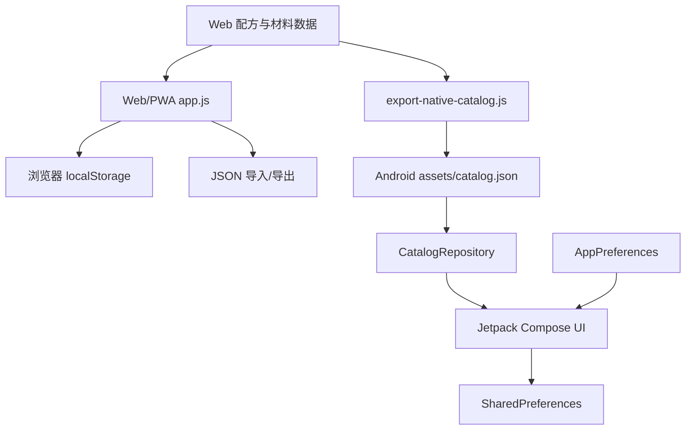

# 朝露酒笺产品详细方案（Web v0.2 / Android v0.3 Alpha）

## 版本状态

- Web/PWA v0.2 Beta 继续作为功能完整的本地优先版本。
- Android v0.3.0-alpha01 已迁移为 Kotlin + Jetpack Compose 原生应用，不再以 Capacitor/WebView 加载 HTML。
- 原生 Alpha 当前重点是原生架构、自适应布局、品牌视觉和核心浏览流程；正式覆盖升级前仍需完成功能对等、旧数据迁移、release 签名和设备验收。

## 1. 产品定位

**朝露酒笺**是一款为家庭调酒爱好者设计的本地优先调酒工具。它不以专业酒吧库存系统为第一目标，而是解决家庭环境中的实际问题：手边只有少量基酒、便利店饮料和常见水果时，如何快速找到能做的酒、理解制作步骤，并逐渐建立自己的酒单与酒柜。

英文名称为 **Dawn's Dew**，与中文名称共同表达“夜色将尽、微醺未散”的视觉和情绪方向。

## 2. 目标用户

- 刚开始学习调酒、希望步骤直观的家庭爱好者
- 已经购买少量基酒，希望提高材料利用率的用户
- 喜欢记录个人配方、商品饮料组合与口味评级的用户
- 聚会时需要快速、随机且尽量不重复推荐的人
- 希望所有私人酒柜数据保存在本机的用户

## 3. 核心场景

1. **查看配方**：浏览个人酒单、经典酒和便利店灵感。
2. **按材料找酒**：勾选家中现有材料，快速显示可以制作的配方。
3. **学习调酒**：查看双语材料、制作方式、顺序和难度。
4. **聚会推荐**：优先从可制作配方中随机，并在短期内避免重复。
5. **管理酒柜**：记录材料、库存、价格、包装容量和实际酒精度。
6. **记录灵感**：创建自己的双语配方，并参与搜索和匹配。
7. **今夜酒单**：把本次聚会或当晚想喝的配方临时整理成独立酒单。
8. **迁移与备份**：通过 JSON 文件把数据带到另一台设备。

## 4. v0.2 功能范围

### 4.1 配方库

- 45 杯内置配方；数据按个人、经典和便利店灵感分类。
- 搜索范围包括中文名、英文名、别名、基酒和全部材料。
- 支持来源、基酒、口味、难度、可制作、收藏六类筛选。
- 配方卡片展示来源、评级、难度、估算 ABV 和材料匹配状态。

### 4.2 配方详情

- 双语名称、介绍和步骤。
- 材料用量支持固定毫升、份/个、加至杯量比例、补满四种形式。
- 展示个人原始配方记录，避免结构化过程中丢失语境。
- 展示估算 ABV、酒液量、成本和制作方式。
- 缺少材料可以一键加入酒柜清单。

### 4.3 个人酒柜

每种材料可记录：

- 是否拥有
- 当前库存（ml 或份）
- 购入价格
- 包装容量
- 实际酒精度

系统根据“是否拥有”和大于零的库存判断材料可用性。空库存数值代表只记录拥有状态，不对数量作限制。

### 4.4 随机推荐

- 普通随机：从全部配方中随机。
- 聚会随机：优先从当前可制作配方中选择，并记录最近推荐以减少重复。
- 当可制作集合为空时自动退回全部配方，保证功能始终可用。

### 4.5 今夜酒单、收藏、历史和自定义

- 今夜酒单可收录任意内置或自定义配方，并支持从卡片、详情页、首页和独立页面管理。
- 收藏、今夜酒单和最近查看均自动保存。
- 自定义配方要求中英文名称、中英文步骤、基酒和至少一种材料。
- 自定义配方进入统一配方库，参与筛选、收藏、匹配和估算。

### 4.6 数据管理

- 使用版本键 dawnsdew.v0.2.state 保存。
- 首次启动时自动迁移 dawnsdew.v0.0.1.state，并初始化空的今夜酒单。
- 导出文件包含产品标识、结构版本、导出时间和完整状态。
- 导入前验证版本和基本结构，并把旧状态保存为本地备份。
- 支持重置用户数据；内置配方不会被删除。

## 5. 配方量化规则

### 5.1 杯量

- 默认杯容量为 300 ml。
- 满冰时默认有效酒液容量为 150 ml。
- 用户可在设置中修改两项容量。

### 5.2 顺序计算

材料严格按配方顺序计算：

1. 固定 `ml` 直接累加。
2. `fillTo: 0.8` 表示补到有效容量的 80%。
3. `topUp` 表示补到有效容量的 100%。
4. 后续固定材料仍按原配方加入，因此总量可能超过容量。
5. 超出时不修改原配方，只显示容量警告。

### 5.3 酒精度与成本

```text
估算 ABV = Σ(材料体积 × 材料 ABV) ÷ 总酒液体积
估算成本 = Σ(购入价 ÷ 包装容量 × 本杯用量)
```

装饰物、冰块及按“份/个”计量的材料在首版中不进入液体体积。只要部分液体材料具有价格，系统就展示成本并用星号表示价格覆盖不完整。

## 6. 内容策略

### 6.1 个人配方

- 保留原始中文名称，不擅自标准化商品名。
- 商品名如“水溶C”“莓莓桃桃”“阿萨姆茉莉奶绿”保持原名。
- 个人评级 `S+ / S / B / D` 作为口味记录展示，不解释为专业评分。
- 英文名称采用意境翻译，而不是机械直译。
- 个人版本的“血腥玛丽”和“自由古巴”明确标注“破晓特调版”。

### 6.2 经典与灵感配方

- 经典配方用于家庭学习和结构参考。
- 便利店灵感配方独立编写，不复制第三方项目内容。
- 测试版不使用外部照片，视觉由 CSS 和内联 SVG 生成，降低版权风险并保证离线使用。

## 7. 技术架构

当前采用 Web/PWA 与 Android 原生双轨架构。



Web 技术原则：

- 原生 HTML、CSS、JavaScript，无运行时第三方依赖。
- 不使用本地 `fetch()` 或模块导入，保持 `file://` 使用场景。
- 所有用户输入在渲染前进行 HTML 转义。
- localStorage 状态提供版本化 JSON 导入导出。

Android 技术原则：

- Kotlin + Jetpack Compose 原生界面，不将 HTML/WebView 作为应用主体。
- 构建期从 Web 数据导出只读目录，并保持材料和配方 ID 稳定。
- 用户状态通过原生存储持久化，后续迁移到可测试的版本化状态仓库。
- 原生能力接入优先使用 Android 系统 API，例如 Storage Access Framework。

## 8. 视觉与交互

- 主题命名为“朝露金夜”。
- 主色：暮色紫、酒红、黎明橙和金色高光。
- 两端均使用程序化渐变与抽象杯形，不依赖在线照片。
- Web 使用响应式侧栏/底部导航；原生端在 `< 840dp` 使用底部导航，在更宽窗口使用 Navigation Rail。
- 配方列表采用自适应网格，统计卡、弹窗操作区和文本在窄屏自动重排。
- 动效用于建立层级和状态反馈：环境光、杯型呼吸、卡片入场、页面切换、按压与收藏状态。
- 触屏设备减少无意义 hover；Web 尊重 `prefers-reduced-motion`，Android 尊重系统动画缩放设置。
- 弹窗必须支持键盘焦点管理、Escape/返回关闭和关闭后焦点恢复。

## 9. 非功能目标

- Web 双击即用、PWA 离线可用；原生 APK 不依赖网络完成核心浏览。
- 首屏、搜索、筛选和收藏操作无需网络等待。
- 320dp 窄屏、常见手机、平板和大窗口均能完成核心任务。
- 本地保存失败时给出明确状态，不阻止继续浏览内置配方。
- 数据文件结构可测试，内置配方和材料 ID 必须保持稳定。
- 动效关闭后功能和信息层级保持完整。
- 正式 Android 版满足签名连续性、数据迁移、无障碍和升级回滚要求。

## 10. 后续路线建议

### v0.3 Alpha：原生功能对等

- 拆分 Compose 大型 UI 文件，引入 ViewModel 与可测试状态层。
- 完成酒柜、可制作匹配、ABV/成本计算和更多筛选。
- 完成自定义配方、随机/聚会推荐和最近查看。
- 完成 JSON 导入导出与旧 WebView/localStorage 数据迁移。

### v0.3 Release Candidate：发布工程

- 配置受控 release 签名和 AAB 构建。
- 完成多尺寸、多版本、横屏、分屏、字体缩放和减少动态效果验收。
- 完成覆盖升级、迁移失败回滚、性能和无障碍测试。
- 准备商店素材、隐私说明和发布回滚方案。

### Web 后续增强

- 自定义配方编辑与复制、配方排序和标签多选。
- 库存单位、水果/装饰物成本换算和采购清单。
- 制作后库存扣减、杯型/冰型/稀释率/份数换算。
- 用户主动选择前提下的跨设备同步和社区配方。

## 11. 验收标准

- Web 本地打开后所有核心页面可访问，PWA 首次完整加载后可离线使用。
- 内置配方总数为 45，个人配方为 25；所有材料引用和双语字段完整。
- Web 酒柜、收藏、今夜酒单、自定义配方和设置刷新后可恢复。
- Web v0.2 导出文件可重新导入，并兼容既定旧版备份。
- Web JavaScript 语法、数据完整性和响应式代码检查通过。
- Android 原生工程可生成最低支持 API 24 的 Debug APK，且不加载 HTML/WebView 作为主界面。
- Android 单元测试通过；收藏、今夜酒单和语言设置可恢复。
- 正式覆盖升级前，旧数据迁移、签名连续性、release AAB、设备矩阵、视觉交互和无障碍验收全部通过。